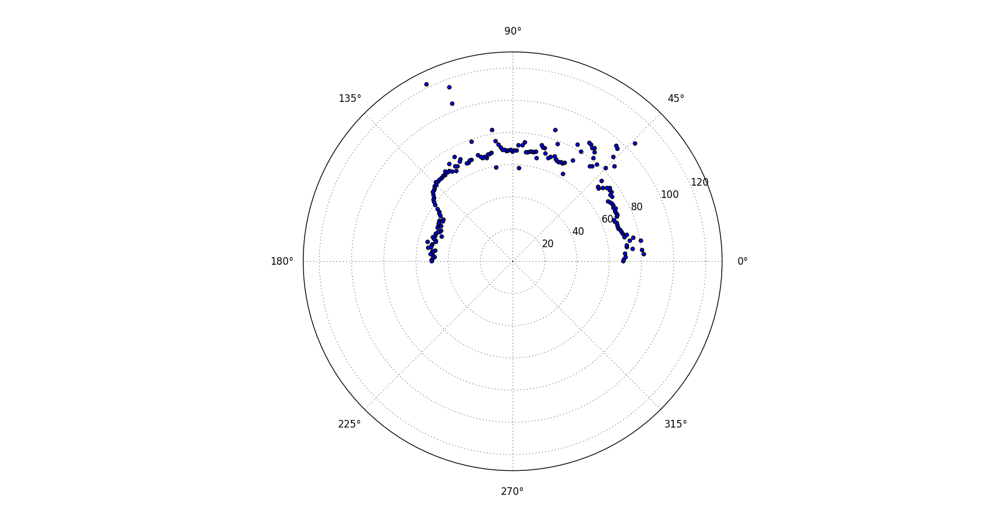
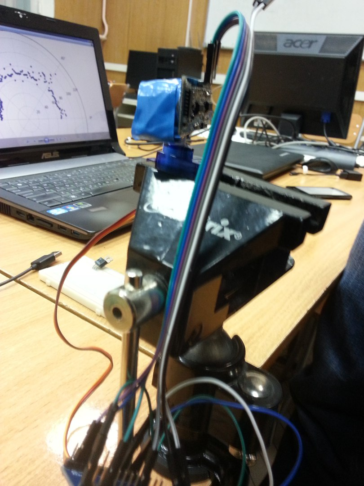
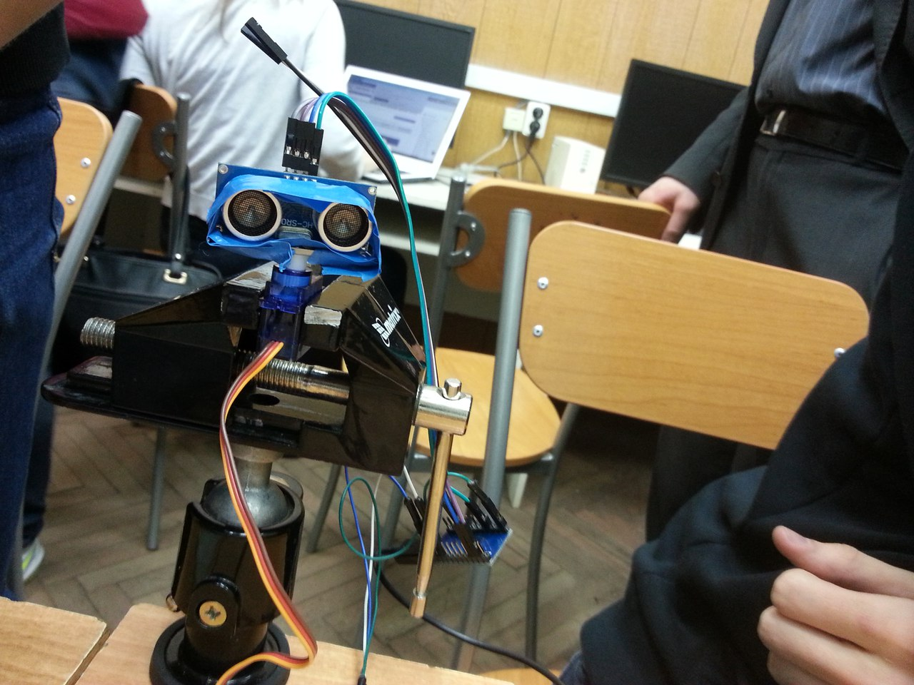
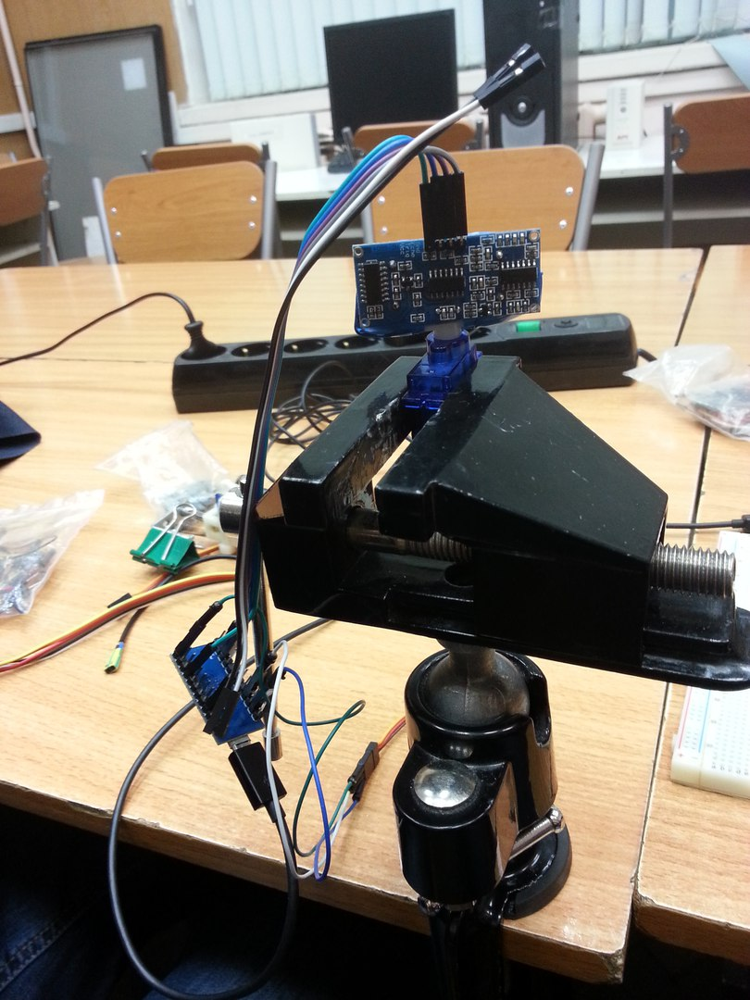

### Работа с ультразвуковым датчиком измерения расстояния HC-SR04, установленным на сервопривод
Считывание значений с ультразвукового датчика измерения расстояния HC-SR04, установленного на сервопривод. Сервопривод совершает обороты на 180 градусов в течение заданного времени. По полученным данным происходит построение графика

